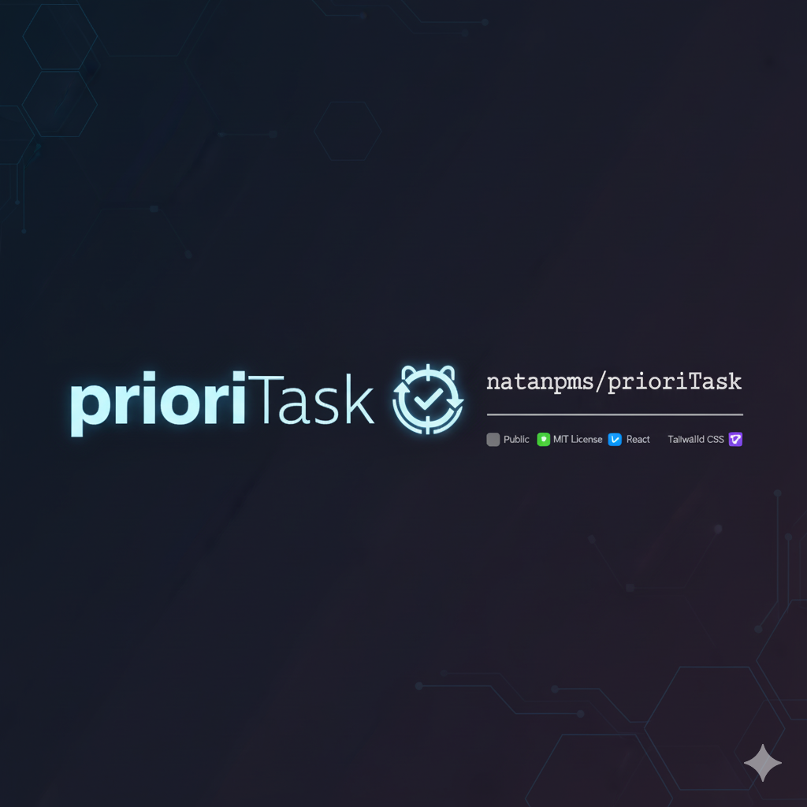

<a id="readme-top"></a>


<!-- PROJECT LOGO -->
<br />
<div align="center">
  <a href="https://github.com/natanpms/prioriTask">
    
  </a>

  <h3 align="center">PrioriTask</h3>

  <p align="center">
    <a href="https://github.com/natanpms/prioriTask"><strong>Explore a documentação »</strong></a>
    <br />
    <br />
    <a href="#">Visualize o beta</a>
    &middot;
    <a href="https://github.com/natanpms/prioriTask/issues/new?labels=bug&template=bug-report---.md">Reporte Bug</a>
    &middot;
    <a href="https://github.com/natanpms/prioriTask/issues/new?labels=enhancement&template=feature-request---.md">Solicite uma Feature</a>
  </p>
</div>

<!-- ABOUT THE PROJECT -->
## Sobre o projeto


A iniciativa do projeto veio de uma dor pessoal do desenvolvedor e de pessoas próximas que sentiam a grande dificuldade de organizar suas tarefas do dia a dia além de sentirem um progresso e necessitavam do acompanhamento do seu desempenho conforme progressão.

Principais ideias:
* Atribuir tasks a metodos de concentração que notifique quando o timer finalizar (por ex, o pomodoro)
* Tarefas organizadas em método KanBan
* Dashboards e relatórios de desempenho
* Criação de categorias 


### STACK

Essa sessão mostra as tecnologias utilizadas durante o periodo de desenvolvimento, isso engloba linguagens, frameworks e libs de UI.

* [![React][React.js]][React-url]
* [![Laravel][Laravel.com]][Laravel-url]
* [![TailwindCSS][TailwindCSS]][TailwindCSS-url]
* [![InertiaJS][InertiaJS]][InertiaJS-url]
* [![ShadcnUI][ShadcnUI]][ShadcnUI-url]
* [![MySQL][MySQL]][MySQL-url]
* [![TypeScript][TypeScript]][TypeScript-url]


<!-- GETTING STARTED -->
## INICIANDO O PROJETO

Essa sessão serve como guia para iniciar o projeto e rodar localmente. Atualmente o guia não contem container mas em breve será padronizado com Docker.

### Requisitos

Requisito para iniciar instalação:
* Node.js ≥ 16 (recomendado 18) + npm ou yarn  
* Composer
* MySQL
* PHP ( versão >= 8.1)

### Instalação

Sessão para guiar instalação e configuração.

1. Clonar o repositório
   ```sh
   git clone https://github.com/natanpms/prioriTask.git
   cd prioriTask

   ```
2. Instalar Composer 
   ```sh
   composer install
   ```
3. Configurar .env
   ```env
   cp .env.example .env

    APP_NAME=PrioriTask
    APP_ENV=local
    APP_KEY=
    APP_URL=http://127.0.0.1:8000

    DB_CONNECTION=mysql
    DB_HOST=127.0.0.1
    DB_PORT=3306
    DB_DATABASE=nome_banco
    DB_USERNAME=root
    DB_PASSWORD=senha

   ```
4. Gerar chave do Laravel
   ```sh
   php artisan key:generate
   ```

5. Instalar dependências do frontend
   ```sh
   npm install
    ```

6. Rodar migrations e seeders
   ```sh
    php artisan migrate
    php artisan db:seed
     ```

7. Caso seja necessário alterar permissões
   ```sh
    sudo chown -R $USER:www-data storage bootstrap/cache
    sudo chmod -R 775 storage bootstrap/cache
     ```
     
8. Iniciar servidor local frontend e backend
   ```sh
    php artisan serve 
    npm run dev
     ```

<p align="right">(<a href="#readme-top">De volta ao topo</a>)</p>

<!-- CONTACT -->
## CONTATO

Natan Porto Machado da Silva - natanssilva10@gmail.com


<!-- MARKDOWN LINKS & IMAGES -->
<!-- https://www.markdownguide.org/basic-syntax/#reference-style-links -->
[contributors-shield]: https://img.shields.io/github/contributors/othneildrew/Best-README-Template.svg?style=for-the-badge
[contributors-url]: https://github.com/othneildrew/Best-README-Template/graphs/contributors
[forks-shield]: https://img.shields.io/github/forks/othneildrew/Best-README-Template.svg?style=for-the-badge
[forks-url]: https://github.com/othneildrew/Best-README-Template/network/members
[stars-shield]: https://img.shields.io/github/stars/othneildrew/Best-README-Template.svg?style=for-the-badge
[stars-url]: https://github.com/othneildrew/Best-README-Template/stargazers
[issues-shield]: https://img.shields.io/github/issues/othneildrew/Best-README-Template.svg?style=for-the-badge
[issues-url]: https://github.com/othneildrew/Best-README-Template/issues
[license-shield]: https://img.shields.io/github/license/othneildrew/Best-README-Template.svg?style=for-the-badge
[license-url]: https://github.com/othneildrew/Best-README-Template/blob/master/LICENSE.txt
[linkedin-shield]: https://img.shields.io/badge/-LinkedIn-black.svg?style=for-the-badge&logo=linkedin&colorB=555
[linkedin-url]: https://linkedin.com/in/othneildrew
[product-screenshot]: images/screenshot.png
[Next.js]: https://img.shields.io/badge/next.js-000000?style=for-the-badge&logo=nextdotjs&logoColor=white
[Next-url]: https://nextjs.org/
[React.js]: https://img.shields.io/badge/React-20232A?style=for-the-badge&logo=react&logoColor=61DAFB
[React-url]: https://reactjs.org/
[Vue.js]: https://img.shields.io/badge/Vue.js-35495E?style=for-the-badge&logo=vuedotjs&logoColor=4FC08D
[Vue-url]: https://vuejs.org/
[Angular.io]: https://img.shields.io/badge/Angular-DD0031?style=for-the-badge&logo=angular&logoColor=white
[Angular-url]: https://angular.io/
[Svelte.dev]: https://img.shields.io/badge/Svelte-4A4A55?style=for-the-badge&logo=svelte&logoColor=FF3E00
[Svelte-url]: https://svelte.dev/
[Laravel.com]: https://img.shields.io/badge/Laravel-FF2D20?style=for-the-badge&logo=laravel&logoColor=white
[Laravel-url]: https://laravel.com
[Bootstrap.com]: https://img.shields.io/badge/Bootstrap-563D7C?style=for-the-badge&logo=bootstrap&logoColor=white
[Bootstrap-url]: https://getbootstrap.com
[JQuery.com]: https://img.shields.io/badge/jQuery-0769AD?style=for-the-badge&logo=jquery&logoColor=white
[JQuery-url]: https://jquery.com 
[TailwindCSS]: https://img.shields.io/badge/TailwindCSS-38B2AC?style=for-the-badge&logo=tailwindcss&logoColor=white
[TailwindCSS-url]: https://tailwindcss.com/
[InertiaJS]: https://img.shields.io/badge/Inertia.js-9553e9?style=for-the-badge&logo=inertia&logoColor=white
[InertiaJS-url]: https://inertiajs.com/
[ShadcnUI]: https://img.shields.io/badge/Shadcn%2FUI-000000?style=for-the-badge&logo=shadcnui&logoColor=white
[ShadcnUI-url]: https://ui.shadcn.com/
[MySQL]: https://img.shields.io/badge/MySQL-4479A1?style=for-the-badge&logo=mysql&logoColor=white
[MySQL-url]: https://www.mysql.com/
[TypeScript]: https://img.shields.io/badge/TypeScript-3178C6?style=for-the-badge&logo=typescript&logoColor=white
[TypeScript-url]: https://www.typescriptlang.org/
